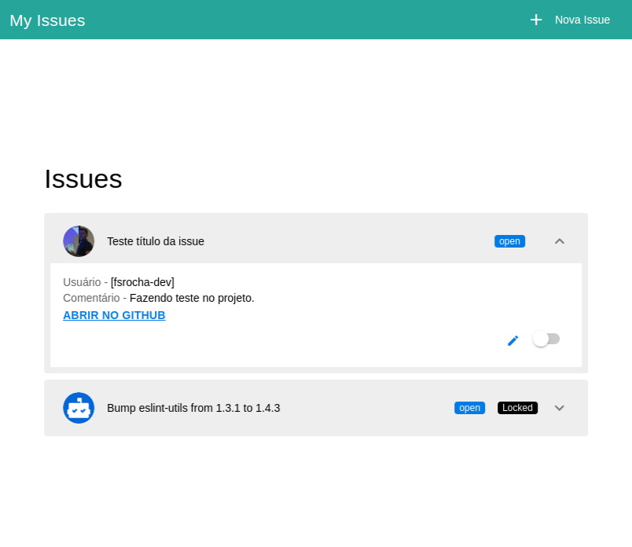

# Vue avançado com github API

## Preview

<p align="center">
    
</p>

## Para Instalar

```
npm install
```

### Para rodar o projeto local

```
npm run serve
```

### Observações

Deixei uma key e meu repositório configurado para testes, logo após irei apagar.
